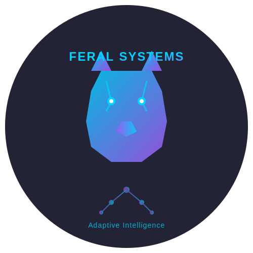
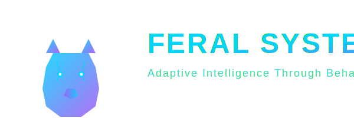
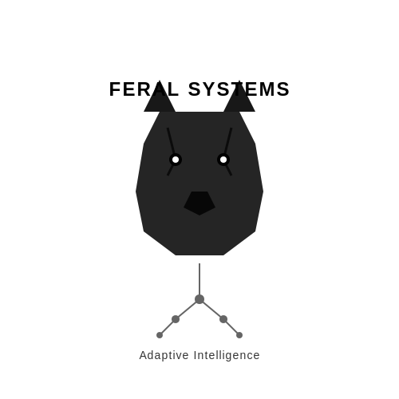

# Feral Systems Brand Guidelines

**Version 1.0 | January 2026**

---

## Table of Contents

1. [Brand Overview](#brand-overview)
2. [Logo System](#logo-system)
3. [Color Palette](#color-palette)
4. [Typography](#typography)
5. [Visual Elements](#visual-elements)
6. [Design Principles](#design-principles)
7. [Applications](#applications)
8. [Usage Guidelines](#usage-guidelines)

---

## Brand Overview

### Brand Essence

**Feral Systems** represents the intersection of behavioral science, artificial intelligence, and adaptive systems design. We specialize in understanding and optimizing "feral" information systems—the organic, unplanned technology ecosystems that naturally emerge within organizations.

### Brand Personality

- **Adaptive**: Like wolves in nature, we thrive in complex, changing environments
- **Intelligent**: Data-driven, evidence-based, scientifically rigorous
- **Modern**: Cutting-edge technology and methodology
- **Professional**: Trusted advisor in critical business transformations
- **Innovative**: Unique approach combining Nudge Theory and Generative AI

### Brand Positioning

Expert in feral information systems and shadow IT, using behavioral design and adaptive intelligence to transform organizational challenges into strategic advantages.

---

## Logo System

### Primary Logo



**File**: `logo-primary.svg`
- **Use for**: Main applications, headers, presentations
- **Dimensions**: 500x500px (scalable)
- **Background**: Dark backgrounds preferred

### Logo Mark (Icon Only)


**File**: `logo-mark.svg`
- **Use for**: Social media avatars, app icons, small spaces
- **Dimensions**: 200x200px (scalable)
- **Minimum size**: 32px

### Horizontal Logo



**File**: `logo-horizontal.svg`
- **Use for**: Email signatures, website headers, letterheads
- **Dimensions**: 600x200px (scalable)
- **Ideal for**: Wide format applications

### Monochrome Logo



**File**: `logo-monochrome.svg`
- **Use for**: Single-color printing, watermarks, special applications
- **Available in**: Black, white (reverse)

### Logo Symbolism

**Wolf Head**: Represents adaptability, pack intelligence, and natural problem-solving abilities

**Geometric Design**: Modern, angular interpretation conveys technological sophistication

**Network Connections**: Circuit-like patterns symbolize "systems" and interconnected solutions

**Gradient Flow**: Represents the spectrum of solutions and adaptive approaches

---

## Color Palette

### Primary Colors

#### Electric Cyan
- **Hex**: `#00d4ff`
- **RGB**: `rgb(0, 212, 255)`
- **CMYK**: `c100 m17 y0 k0`
- **Pantone**: 2985 C (closest match)
- **Usage**: Primary accent, interactive elements, primary headings
- **Accessibility**: AAA rating on dark backgrounds

#### Vivid Purple
- **Hex**: `#a855f7`
- **RGB**: `rgb(168, 85, 247)`
- **CMYK**: `c47 m66 y0 k0`
- **Pantone**: 2665 C (closest match)
- **Usage**: Secondary accent, highlights, borders, CTAs
- **Accessibility**: AA rating on dark backgrounds

### Gradient Combinations

#### Primary Gradient (45° diagonal)
```css
background: linear-gradient(45deg, #00d4ff, #a855f7);
```
**Usage**: Buttons, headings, featured elements

#### Accent Gradient (horizontal)
```css
background: linear-gradient(90deg, #a855f7, #00d4ff);
```
**Usage**: Borders, dividers, decorative elements

### Background Colors

#### Deep Navy
- **Hex**: `#1a1a2e`
- **RGB**: `rgb(26, 26, 46)`
- **Usage**: Primary background (left side of gradient)

#### Dark Blue
- **Hex**: `#16213e`
- **RGB**: `rgb(22, 33, 62)`
- **Usage**: Background center tone

#### Rich Blue
- **Hex**: `#0f3460`
- **RGB**: `rgb(15, 52, 96)`
- **Usage**: Background (right side of gradient)

#### Background Gradient
```css
background: linear-gradient(135deg, #1a1a2e 0%, #16213e 50%, #0f3460 100%);
```

### Text Colors

#### Primary Text (White)
- **Hex**: `#ffffff`
- **RGB**: `rgb(255, 255, 255)`
- **Usage**: Body text, main content
- **Accessibility**: AAA rating on all backgrounds

#### Secondary Text (Light Gray)
- **Hex**: `#e2e8f0`
- **RGB**: `rgb(226, 232, 240)`
- **Usage**: Subtitles, supporting text, captions
- **Accessibility**: AA rating on dark backgrounds

### Semantic Colors

#### Success
- **Hex**: `#10b981`
- **RGB**: `rgb(16, 185, 129)`

#### Warning
- **Hex**: `#f59e0b`
- **RGB**: `rgb(245, 158, 11)`

#### Error
- **Hex**: `#ef4444`
- **RGB**: `rgb(239, 68, 68)`

#### Info
- **Hex**: `#3b82f6`
- **RGB**: `rgb(59, 130, 246)`

### Color Accessibility Matrix

| Foreground | Background | Contrast Ratio | WCAG Rating |
|------------|------------|----------------|-------------|
| #ffffff    | #1a1a2e    | 15.8:1         | AAA         |
| #00d4ff    | #1a1a2e    | 11.2:1         | AAA         |
| #a855f7    | #1a1a2e    | 6.5:1          | AA          |
| #e2e8f0    | #1a1a2e    | 13.1:1         | AAA         |

---

## Typography

### Font Families

#### Display Font: Lastica

**File**: `lastica.woff2`, `lastica-bold.woff2`

**Usage**:
- Logo text
- Section headings (H1, H2)
- Feature titles
- Call-to-action buttons

**Weights Available**:
- Regular (400)
- Bold (700)

**Characteristics**: Modern, distinctive, geometric
**Fallback**: `'Lastica', 'Arial', 'Helvetica', sans-serif`

#### Body Font: Anonymous Pro

**File**: `anonymous-pro-*.woff2` (regular, bold, italic, bold-italic)

**Usage**:
- Body text
- Paragraphs
- Lists
- Captions
- Technical content

**Weights Available**:
- Regular (400)
- Bold (700)
- Italic (400)
- Bold Italic (700)

**Characteristics**: Monospace, technical, professional, excellent readability
**Fallback**: `'Anonymous Pro', 'Courier New', monospace`

### Type Scale

```css
/* Headings */
--font-size-h1: 3.5rem;      /* 56px */
--font-size-h2: 2.5rem;      /* 40px */
--font-size-h3: 2rem;        /* 32px */
--font-size-h4: 1.5rem;      /* 24px */
--font-size-h5: 1.25rem;     /* 20px */

/* Body */
--font-size-body: 1.125rem;  /* 18px */
--font-size-small: 0.875rem; /* 14px */
--font-size-caption: 0.75rem;/* 12px */
```

### Typography Guidelines

**Line Height**:
- Headings: 1.2
- Body: 1.8
- Captions: 1.5

**Letter Spacing**:
- Large headings: 2-3px
- Body: Normal (0)
- Small text: 1px

**Paragraph Spacing**: 1.5rem (24px) between paragraphs

---

## Visual Elements

### Glass Morphism Effects

```css
/* Card backgrounds */
background: rgba(255, 255, 255, 0.08);
backdrop-filter: blur(10px);
border-radius: 20px;
```

```css
/* Header/Navigation */
background: rgba(0, 0, 0, 0.3);
backdrop-filter: blur(15px);
```

### Border Styles

**Gradient Borders** (top of cards):
```css
border-top: 3px solid;
border-image: linear-gradient(45deg, #00d4ff, #a855f7) 1;
```

**Standard Borders**:
```css
border: 1px solid rgba(255, 255, 255, 0.1);
```

### Border Radius Scale

- **Small**: 8px (buttons, inputs)
- **Medium**: 20px (cards, containers)
- **Large**: 50px (pill buttons)
- **Round**: 50% (circles, avatars)

### Shadows

**Card Elevation**:
```css
box-shadow: 0 8px 32px rgba(0, 0, 0, 0.3);
```

**Hover State**:
```css
box-shadow: 0 12px 48px rgba(0, 212, 255, 0.3);
```

**Button Focus**:
```css
box-shadow: 0 0 20px rgba(168, 85, 247, 0.5);
```

### Animations

**Transition Standard**:
```css
transition: all 0.3s ease;
```

**Hover Transform**:
```css
transform: translateY(-5px);
```

**Fade In**:
```css
@keyframes fadeIn {
  from { opacity: 0; transform: translateY(20px); }
  to { opacity: 1; transform: translateY(0); }
}
```

---

## Design Principles

### 1. Adaptive by Design

Every element should feel fluid and responsive, reflecting our core value of adaptability. Use smooth transitions and hover states.

### 2. Technical Sophistication

Employ modern CSS techniques (glass morphism, gradients, blur effects) to convey technical expertise without overwhelming users.

### 3. Professional Trust

Maintain clean layouts, generous whitespace, and clear hierarchy to build confidence and credibility.

### 4. Gradient as Guide

Use gradients strategically to draw attention and create visual flow. The cyan-to-purple gradient represents our spectrum of solutions.

### 5. Data-Driven Aesthetics

Every design choice should have a purpose. Prefer clarity over decoration.

---

## Applications

### Website Design

**Navigation**: Fixed header with glass morphism effect
**Sections**: Full-viewport height with gradient background
**Cards**: Semi-transparent with gradient top borders
**Buttons**: Gradient fill with rounded corners
**Hover States**: Elevation increase + subtle color shift

### Business Cards

**Front**:
- Logo mark (top right)
- Name (Lastica Bold, gradient)
- Title (Anonymous Pro Regular, white)
- Contact (Anonymous Pro Regular, light gray)

**Back**:
- Horizontal logo
- Tagline
- Website URL

### Presentation Templates

**Title Slide**:
- Large logo
- Gradient background
- White text for title

**Content Slides**:
- Logo mark (top corner)
- Headings in Lastica
- Body in Anonymous Pro
- Accent colors for data visualization

### Social Media

**Profile Image**: Logo mark (200x200)
**Cover Images**: Horizontal logo with gradient background
**Posts**: Dark background, cyan/purple accents, Lastica for headings

---

## Usage Guidelines

### Logo Do's

✅ Use on dark backgrounds (primary)
✅ Maintain clear space (minimum 20px around logo)
✅ Scale proportionally
✅ Use provided file formats (SVG preferred)
✅ Use monochrome version for single-color applications

### Logo Don'ts

❌ Don't place on light backgrounds without adjustment
❌ Don't distort or stretch
❌ Don't change colors outside brand palette
❌ Don't add effects (drop shadows, glows) not in original
❌ Don't rotate or skew
❌ Don't use low-resolution raster versions when vector available

### Color Usage

✅ **Primary Gradient**: Use for main CTAs and headings
✅ **Cyan**: Interactive elements, links, primary actions
✅ **Purple**: Secondary actions, highlights, accents
✅ **Dark backgrounds**: Preferred for all applications
✅ **White text**: Primary text on all dark backgrounds

❌ **Don't**: Use bright colors on light backgrounds
❌ **Don't**: Mix gradients in unintended ways
❌ **Don't**: Use colors outside the defined palette

### Typography Usage

✅ **Lastica**: Headings, titles, feature names
✅ **Anonymous Pro**: All body content
✅ **Hierarchy**: Maintain consistent size relationships
✅ **Line length**: 60-80 characters for optimal readability

❌ **Don't**: Use system fonts for headings
❌ **Don't**: Set body text smaller than 16px
❌ **Don't**: Exceed 3-4 font sizes per design
❌ **Don't**: Use all caps except for short labels

---

## Brand Voice

### Tone

**Professional but Approachable**: We're experts, but we explain complex concepts clearly.

**Confident, Not Arrogant**: We know our field, but we listen and collaborate.

**Scientific and Evidence-Based**: Back claims with data and research.

**Forward-Thinking**: Focus on innovation and future solutions.

### Writing Style

- Use active voice
- Prefer shorter sentences
- Define technical terms
- Use metaphors from nature (wolves, ecosystems, evolution)
- Be specific and concrete

### Example Phrases

✅ "We adapt to your unique ecosystem"
✅ "Evidence-based behavioral design"
✅ "Transform feral systems into strategic assets"
✅ "Intelligent, adaptive solutions"

❌ "We're the best in the business"
❌ "Revolutionary game-changer"
❌ "One-size-fits-all solution"

---

## File Structure

```
brand/
├── logos/
│   ├── logo-primary.svg
│   ├── logo-mark.svg
│   ├── logo-horizontal.svg
│   ├── logo-monochrome.svg
│   ├── logo-light.svg (for dark backgrounds)
│   └── exports/
│       ├── png/
│       ├── pdf/
│       └── eps/
├── fonts/
│   ├── lastica.woff2
│   ├── lastica-bold.woff2
│   ├── anonymous-pro-regular.woff2
│   ├── anonymous-pro-bold.woff2
│   ├── anonymous-pro-italic.woff2
│   └── anonymous-pro-bold-italic.woff2
├── colors/
│   └── palette.ase (Adobe Swatch)
├── templates/
│   ├── business-card.pdf
│   ├── letterhead.pdf
│   ├── presentation.pptx
│   └── social-media/
└── BRAND-GUIDELINES.md (this file)
```

---

## Contact

For brand questions or asset requests:
**Email**: [brand@feralsystems.com]
**Website**: [feralsystems.com]

---

**Last Updated**: January 17, 2026
**Version**: 1.0
**Maintained by**: Feral Systems Brand Team
